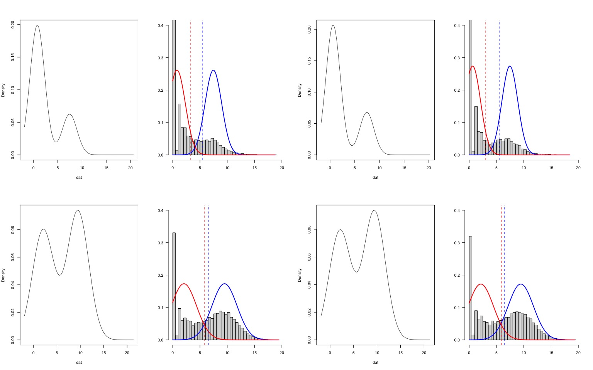
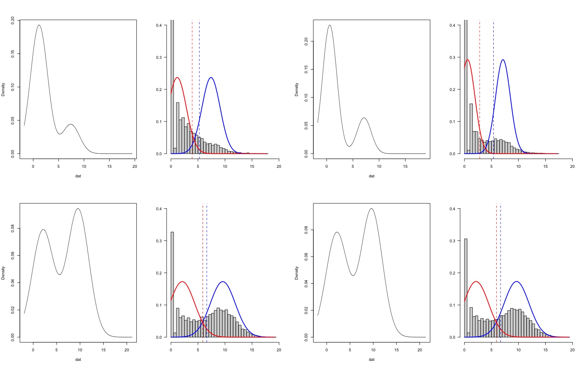
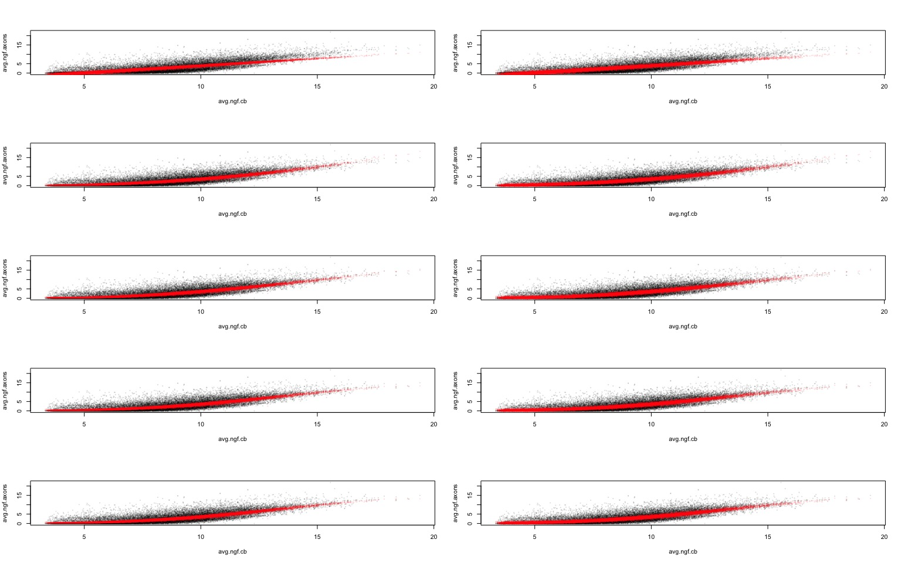
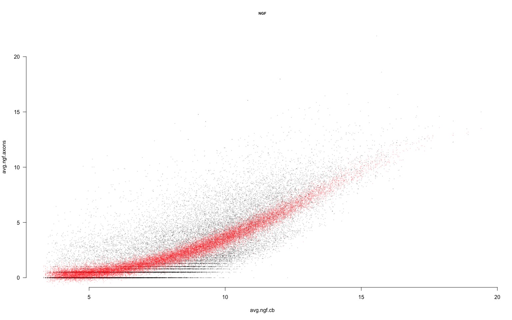
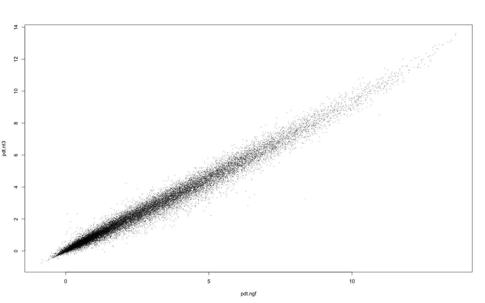
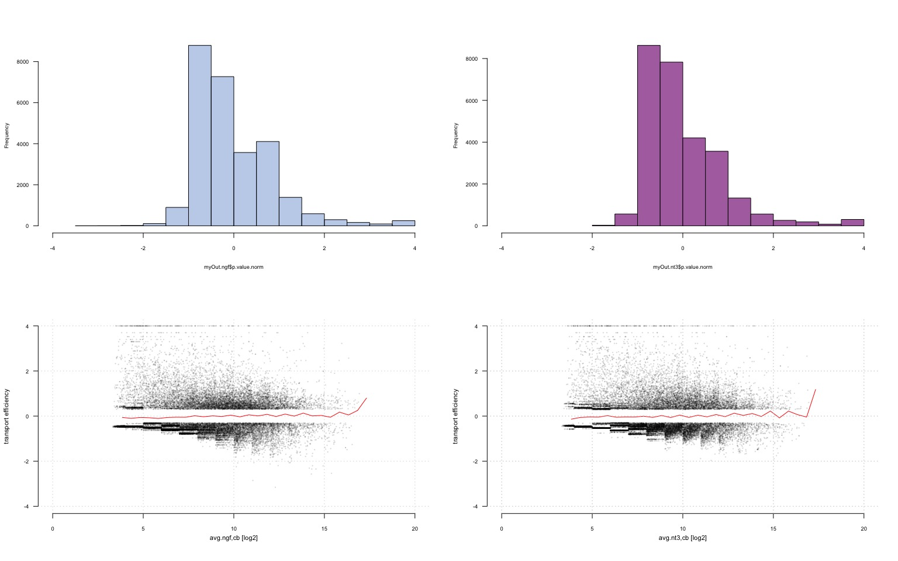
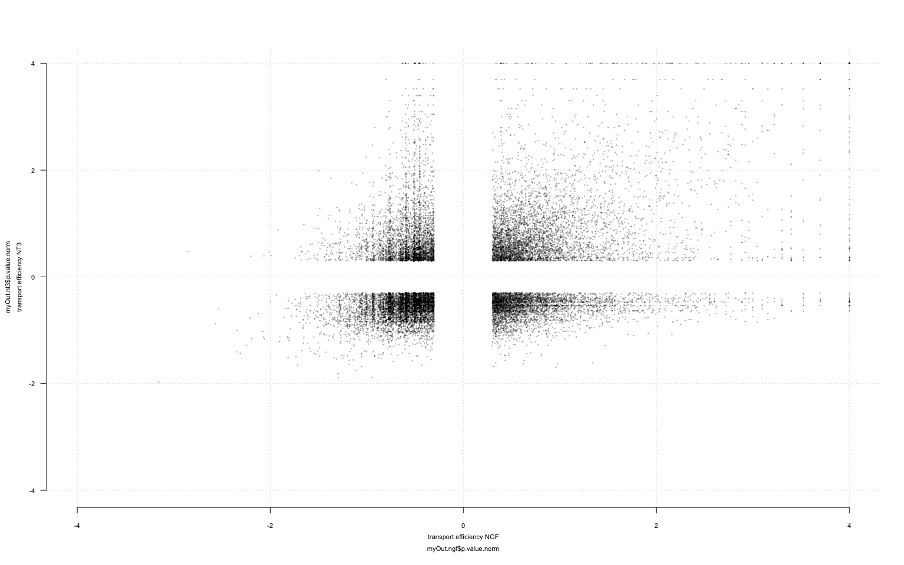
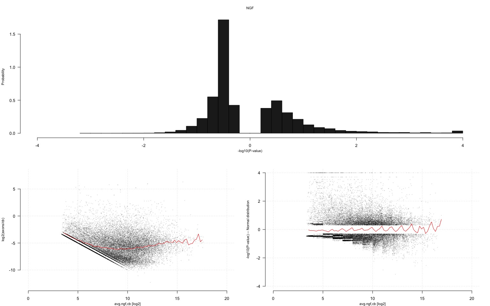
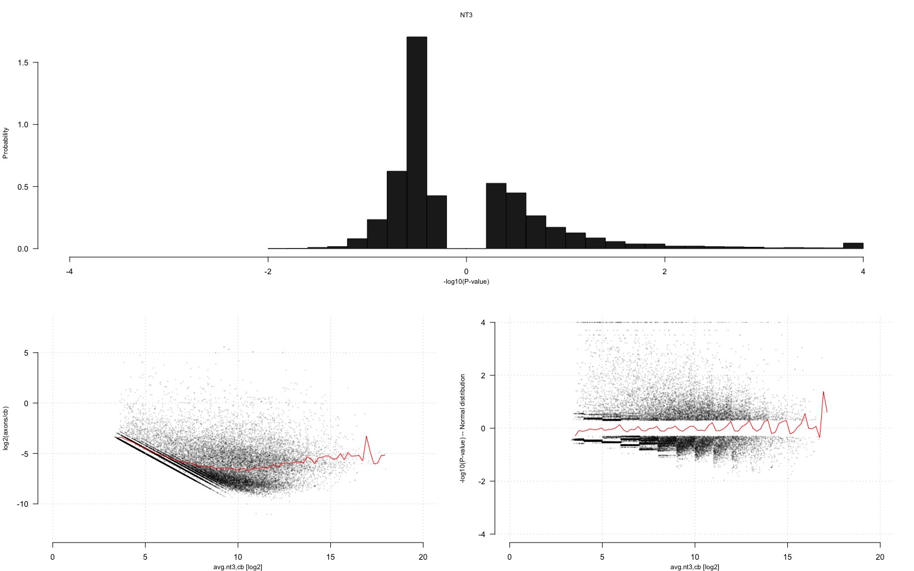
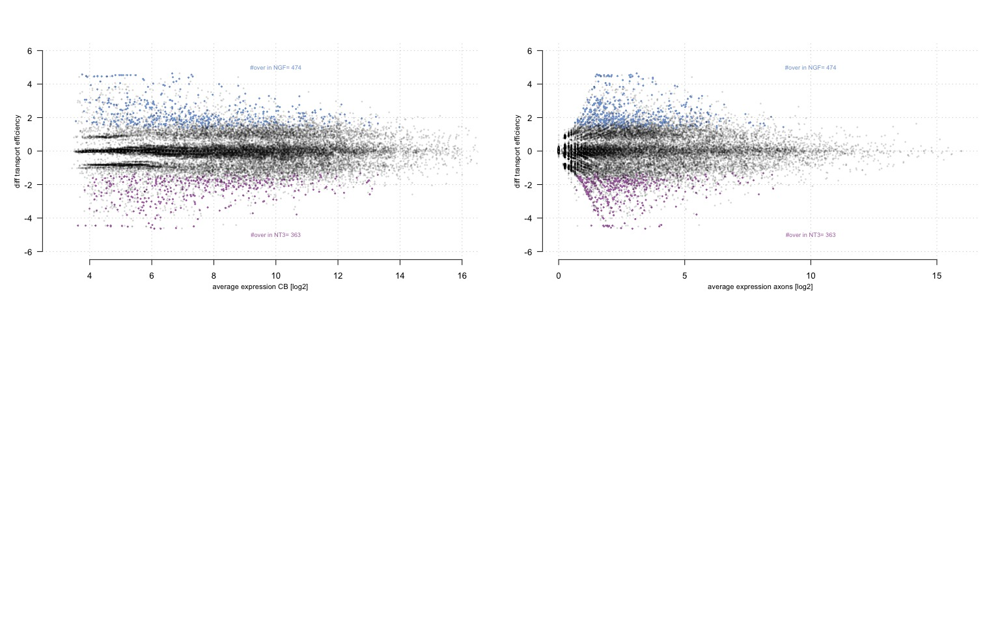

Axonal Localisation Score
================
Raphaëlle Luisier
Idiap Research Institute – February 2023

Interestingly, transcripts that are highly expressed in cell bodies are
not necessarily enriched in axons or dendrites, indicating that at least
a subset of RNAs do not reach the peripheral compartments by ‘passive’
transport but are sorted and delivered with an selective mechanism.

First load the data.

Next select the reliably expressed 3’ UTR isoforms fit fitting binomial
distribution.

``` r
par(mfrow=c(2,4))
coloi <- c("NGF.axon.1.raw.corrected","NGF.axon.2.raw.corrected","NGF.cb.1.raw.corrected","NGF.cb.2.raw.corrected","NT3.axon.1.raw.corrected","NT3.axon.2.raw.corrected","NT3.cb.1.raw.corrected","NT3.cb.2.raw.corrected")
mydat                <- anno_tot[which(anno_tot$is.conservative),match(coloi,colnames(anno_tot))]
mydatall             <- anno_tot[,match(coloi,colnames(anno_tot))]
for(i in c(1:ncol(mydat))){
  mydat[,i] <- log2(mydat[,i]+1)
}
lims      <- apply(mydat,2,function(Z)2^SelectExpressed(dat=Z,frac.bg=0.95,frac.fg=0.1))
```

<!-- --><!-- -->

``` r
tempsel   <- apply(mydatall,2,function(Z)return(Z>=mean(lims[1,c(1,2)])))
soft.sel  <- cbind(tempsel[,1]&tempsel[,2],tempsel[,3]&tempsel[,4],tempsel[,5]&tempsel[,6],tempsel[,7]&tempsel[,8])
tempsel   <- do.call(what=cbind,lapply(c(1:8),function(Z)return(mydatall[,Z]>=lims[2,Z])))
hard.sel  <- cbind(tempsel[,1]|tempsel[,2],tempsel[,3]|tempsel[,4],tempsel[,5]|tempsel[,6],tempsel[,7]|tempsel[,8])
final.sel <- cbind(soft.sel[,1]|hard.sel[,1],soft.sel[,2]|hard.sel[,2],soft.sel[,3]|hard.sel[,3],soft.sel[,4]|hard.sel[,4])

anno_tot$NGF.axon.is.expressed.iso          <- final.sel[,1]
anno_tot$NGF.cb.is.expressed.iso            <- final.sel[,2]
anno_tot$NT3.axon.is.expressed.iso          <- final.sel[,3]
anno_tot$NT3.cb.is.expressed.iso            <- final.sel[,4]


#A. Select only those reliably expressed in CB of both NGF and NT3
coloi                <- grep(colnames(anno_tot),pattern=".raw.corrected")
seloi                <- anno_tot$NT3.cb.is.expressed.iso&anno_tot$NGF.cb.is.expressed.iso#If we want to study differential transport, we need to make sure that things are expressed at least in both NGF and NT3 CB
data.con.cb          <- anno_tot[seloi,coloi]
row_info             <- anno_tot[seloi,]
anno_tot             <- anno_tot[seloi,]
mydatall             <- log2(1+data.con.cb)
myUTR                <- myUTR[seloi,]


#B. Compute average expression in each compartment
avg.ngf.axons <- apply(mydatall[,c("NGF.axon.1.raw.corrected","NGF.axon.2.raw.corrected")],1,mean)
avg.nt3.axons <- apply(mydatall[,c("NT3.axon.1.raw.corrected","NT3.axon.2.raw.corrected")],1,mean)
avg.ngf.cb    <- apply(mydatall[,c("NGF.cb.1.raw.corrected","NGF.cb.2.raw.corrected")],1,mean)
avg.nt3.cb    <- apply(mydatall[,c("NT3.cb.1.raw.corrected","NT3.cb.2.raw.corrected")],1,mean)
avg.cb        <- apply(mydatall[,c("NT3.cb.1.raw.corrected","NT3.cb.2.raw.corrected","NGF.cb.1.raw.corrected","NGF.cb.2.raw.corrected")],1,mean)
avg.ax        <- apply(mydatall[,c("NGF.axon.1.raw.corrected","NGF.axon.2.raw.corrected","NT3.axon.1.raw.corrected","NT3.axon.2.raw.corrected")],1,mean)

avg.ngf.axons.raw <- apply(data.con.cb[,c("NGF.axon.1.raw.corrected","NGF.axon.2.raw.corrected")],1,mean)
avg.nt3.axons.raw <- apply(data.con.cb[,c("NT3.axon.1.raw.corrected","NT3.axon.2.raw.corrected")],1,mean)
avg.ngf.cb.raw    <- apply(data.con.cb[,c("NGF.cb.1.raw.corrected","NGF.cb.2.raw.corrected")],1,mean)
avg.nt3.cb.raw    <- apply(data.con.cb[,c("NT3.cb.1.raw.corrected","NT3.cb.2.raw.corrected")],1,mean)
```

We first aim to learn a linear model that predicts the axonal read
counts in function of the transcripts length (log10) and the read count
in the cell body.

``` r
# C. Modelling axonal transport in function of 1) read counts in CB and 2) tx length
# With the linear model --using both size and expression in CB -- the aim is to identify those which are not behaving in the same way as most other species of the same size 
# Linear model to measure the extend of deviation from the linear model

dat.ngf           <- data.frame(txL=log10(anno_tot$txLength[match(names(avg.ngf.axons),anno_tot$uniqueID)]),
                                cb=avg.ngf.cb,
                                axons=avg.ngf.axons)
dat.nt3           <- data.frame(txL=log10(anno_tot$txLength[match(names(avg.nt3.axons),anno_tot$uniqueID)]),
                                cb=avg.nt3.cb,
                                axons=avg.nt3.axons)

dat.ngf           <- data.frame(txL=log10(anno_tot$txLength),
                                cb=avg.ngf.cb,
                                axons=avg.ngf.axons)
dat.nt3           <- data.frame(txL=log10(anno_tot$txLength),
                                cb=avg.nt3.cb,
                                axons=avg.nt3.axons)

polyfit <- function(i) x <- AIC(lm(axons~poly(cb,i)+txL,dat=dat.ngf))

fit1.1 <- lm(axons~cb,dat=dat.ngf)
fit1.2 <- lm(axons~cb+txL,dat=dat.ngf)
fit2.1 <- lm(axons~poly(cb,2),dat=dat.ngf)
fit2.2 <- lm(axons~poly(cb,2)+txL,dat=dat.ngf)
fit3.1 <- lm(axons~poly(cb,3),dat=dat.ngf)
fit3.2 <- lm(axons~poly(cb,3)+txL,dat=dat.ngf)
fit4.1 <- lm(axons~poly(cb,4),dat=dat.ngf)
fit4.2 <- lm(axons~poly(cb,4)+txL,dat=dat.ngf)#selected one
fit5.1 <- lm(axons~poly(cb,5),dat=dat.ngf)
fit5.2 <- lm(axons~poly(cb,5)+txL,dat=dat.ngf)
print(AIC(fit1.1,fit1.2,fit2.1,fit2.2,fit3.1,fit3.2,fit4.1,fit4.2,fit5.1,fit5.2))
```

    ##        df      AIC
    ## fit1.1  3 111813.1
    ## fit1.2  4 110811.2
    ## fit2.1  4 109015.4
    ## fit2.2  5 108049.9
    ## fit3.1  5 108812.1
    ## fit3.2  6 107837.8
    ## fit4.1  6 108796.7
    ## fit4.2  7 107825.3
    ## fit5.1  7 108798.5
    ## fit5.2  8 107827.0

``` r
anova(fit4.2,fit5.2,test="Chisq")
```

    ## Analysis of Variance Table
    ## 
    ## Model 1: axons ~ poly(cb, 4) + txL
    ## Model 2: axons ~ poly(cb, 5) + txL
    ##   Res.Df   RSS Df Sum of Sq Pr(>Chi)
    ## 1  27654 79825                      
    ## 2  27653 79825  1   0.85188    0.587

``` r
anova(fit4.2,fit4.1,test="Chisq")
```

    ## Analysis of Variance Table
    ## 
    ## Model 1: axons ~ poly(cb, 4) + txL
    ## Model 2: axons ~ poly(cb, 4)
    ##   Res.Df   RSS Df Sum of Sq  Pr(>Chi)    
    ## 1  27654 79825                           
    ## 2  27655 82685 -1   -2859.5 < 2.2e-16 ***
    ## ---
    ## Signif. codes:  0 '***' 0.001 '**' 0.01 '*' 0.05 '.' 0.1 ' ' 1

``` r
fit1.1 <- lm(axons~cb,dat=dat.nt3)
fit1.2 <- lm(axons~cb+txL,dat=dat.nt3)
fit2.1 <- lm(axons~poly(cb,2),dat=dat.nt3)
fit2.2 <- lm(axons~poly(cb,2)+txL,dat=dat.nt3)
fit3.1 <- lm(axons~poly(cb,3),dat=dat.nt3)
fit3.2 <- lm(axons~poly(cb,3)+txL,dat=dat.nt3)
fit4.1 <- lm(axons~poly(cb,4),dat=dat.nt3)
fit4.2 <- lm(axons~poly(cb,4)+txL,dat=dat.nt3)#selected one
fit5.1 <- lm(axons~poly(cb,5),dat=dat.nt3)
fit5.2 <- lm(axons~poly(cb,5)+txL,dat=dat.nt3)
print(AIC(fit1.1,fit1.2,fit2.1,fit2.2,fit3.1,fit3.2,fit4.1,fit4.2,fit5.1,fit5.2))
```

    ##        df       AIC
    ## fit1.1  3 104426.29
    ## fit1.2  4 103368.63
    ## fit2.1  4 100569.12
    ## fit2.2  5  99526.10
    ## fit3.1  5 100443.77
    ## fit3.2  6  99387.70
    ## fit4.1  6 100412.76
    ## fit4.2  7  99362.37
    ## fit5.1  7 100414.63
    ## fit5.2  8  99364.19

``` r
anova(fit4.2,fit5.2,test="Chisq")
```

    ## Analysis of Variance Table
    ## 
    ## Model 1: axons ~ poly(cb, 4) + txL
    ## Model 2: axons ~ poly(cb, 5) + txL
    ##   Res.Df   RSS Df Sum of Sq Pr(>Chi)
    ## 1  27654 58785                      
    ## 2  27653 58784  1   0.37677   0.6738

``` r
anova(fit4.2,fit4.1,test="Chisq")
```

    ## Analysis of Variance Table
    ## 
    ## Model 1: axons ~ poly(cb, 4) + txL
    ## Model 2: axons ~ poly(cb, 4)
    ##   Res.Df   RSS Df Sum of Sq  Pr(>Chi)    
    ## 1  27654 58785                           
    ## 2  27655 61064 -1   -2279.7 < 2.2e-16 ***
    ## ---
    ## Signif. codes:  0 '***' 0.001 '**' 0.01 '*' 0.05 '.' 0.1 ' ' 1

``` r
myfits <- list(fit1.1,fit1.2,fit2.1,fit2.2,fit3.1,fit3.2,fit4.1,fit4.2,fit5.1,fit5.2)
par(mfrow=c(5,2))
lapply(myfits,function(Z){
  pdt     <- predict(Z)
  plot(avg.ngf.cb,avg.ngf.axons,pch=19,col=rgb(0,0,0,0.1),cex=0.2,main=,cex.main=0.7)
  points(avg.ngf.cb,pdt,pch=19,col=rgb(1,0,0,0.1),cex=0.2)
})
```

<!-- -->

    ## [[1]]
    ## NULL
    ## 
    ## [[2]]
    ## NULL
    ## 
    ## [[3]]
    ## NULL
    ## 
    ## [[4]]
    ## NULL
    ## 
    ## [[5]]
    ## NULL
    ## 
    ## [[6]]
    ## NULL
    ## 
    ## [[7]]
    ## NULL
    ## 
    ## [[8]]
    ## NULL
    ## 
    ## [[9]]
    ## NULL
    ## 
    ## [[10]]
    ## NULL

Here we check that the predictions (red dots) are close to the observed
read counts for the selected model.

``` r
par(mfrow=c(1,1))
Z=myfits[[8]]
pdt     <- predict(Z)
plot(avg.ngf.cb,avg.ngf.axons,pch=19,col=rgb(0,0,0,0.1),cex=0.2,cex.main=0.7,las=1,frame=FALSE,main="NGF")
points(avg.ngf.cb,pdt,pch=19,col=rgb(1,0,0,0.1),cex=0.2)
```

<!-- -->
We next use use a Bayesian approach to get a localisation score with
positive values indicating over-transport and negative values indicating
under-transport. We first group 3’ UTR isoforms of similar expression
level in the CB and of similar transcript length together. Assuming that
isoforms within a group should exhibit similar expression in the cell
body, of mean and standard-deviation derived from the linear model
learned in the previous step. For each 3’ UTR isoform, we calculate the
likelihood of axonal read count higher or lower than the observed read
counts given the prior distribution.

``` r
#Extract the probability of each data-point being generated to identify those which are under- or over-transported

#A. Fit polynomial of degree 4 to each data-set
fit4.2.ngf      <- lm(axons~poly(cb,4)+txL,dat=dat.ngf)#selected one
fit4.2.nt3      <- lm(axons~poly(cb,4)+txL,dat=dat.nt3)#selected one

#B. Model prediction 
pdt.ngf         <- predict(fit4.2.ngf)
pdt.nt3         <- predict(fit4.2.nt3)
plot(pdt.ngf,pdt.nt3,pch=19,col=rgb(0,0,0,0.2),cex=0.2)
```

<!-- -->

``` r
RUD.ngf         <- avg.ngf.axons-avg.ngf.cb
RUD.nt3         <- avg.nt3.axons-avg.nt3.cb
out.ngf         <- data.frame(dat.ngf,prediction=pdt.ngf,RUD=RUD.ngf,anno_tot[match(names(avg.ngf.axons),anno_tot$uniqueID),],avg.ngf.cb,avg.ngf.axons)
out.nt3         <- data.frame(dat.nt3,prediction=pdt.nt3,RUD=RUD.nt3,anno_tot[match(names(avg.nt3.axons),anno_tot$uniqueID),],avg.nt3.cb,avg.nt3.axons)

#D. Create intervals of expression according to expression in CB and transcript length 
CreateBins <- function(myout){
  bins.cb                        <- cut(myout$cb,breaks=seq(from=3,to=20,by=1),iclude.lowest=T)
  bins.txL                       <- cut(myout$txL,breaks=seq(from=2,to=4.5,by=0.25),iclude.lowest=T)
  bins.both                      <- paste(bins.cb,bins.txL,sep=".")
  temp                           <- data.frame(table(bins.both))
  tokeep                         <- temp$bins.both[temp$Freq>=5] 
  #tokeep                         <- temp$bins.both[temp$Freq>=1] 
  bins.both[!bins.both%in%tokeep]<-NA
  return(factor(as.character(bins.both)))
}
bins.both.ngf <- CreateBins(myout=out.ngf)
bins.both.nt3 <- CreateBins(myout=out.nt3)

#E.Get the probability of the observed read count in the axons larger or smaller than the observed read counts in axons given their observed read counts in the CB and their transcript length

GetProbs <- function(mybins=bins.both.ngf,myfit=fit4.2.ngf,out=out.ngf){
  
  myOut <- do.call(lapply(c(1:length(levels(mybins))),function(IX){
    print(IX)
    myprediction         <- compute.prediction(IX,myfit=myfit,bins=mybins)
    subdat               <- out[which(mybins==levels(mybins)[IX]),]
    if(nrow(subdat)>=10){
      #Fit prior normal distribution of the read counts in the axons with prior mean and sd from prediction given the intervals
      fit.norm    <- fitdist(subdat$axons, "norm",start=list(mean=mean(myprediction),sd=sd(myprediction)))
      #Sample from the prior
      my.rdm.norm <- rnorm(n=10^4, mean=fit.norm$estimate["mean"], sd=fit.norm$estimate["sd"])
      #Compute the posterior prob. i.e. empirical P-value
      temp        <- do.call(what=rbind,lapply(subdat$axons,function(Z)return(c(sum(my.rdm.norm<=Z)/10^4,sum(my.rdm.norm>=Z)/10^4))))
      colnames(temp)<- c("prob(N).smaller","prob(N).bigger")
      temp          <-data.frame(temp,subdat)
      return(temp)
    }
    else{
      temp <- matrix(NA,ncol=2,nrow=nrow(subdat))
      colnames(temp)<- c("prob(N).smaller","prob(N).bigger")
      temp          <-data.frame(temp,subdat)
      return(temp)
    }
    }),what=rbind)
  
  
  p.value.norm <- apply(cbind(-log10(myOut$prob.N..smaller+min(myOut$prob.N..smaller[myOut$prob.N..smaller>0],na.rm=TRUE)),
                              -log10(myOut$prob.N..bigger+min(myOut$prob.N..bigger[myOut$prob.N..bigger>0],na.rm=TRUE))),1,function(Z){
                                M<- max(Z)
                                if(is.na(M))return(NA)
                                if(which(Z==M)[1]==1)return(-M)
                                else
                                  return(M)
                              })

  myOut <- data.frame(p.value.norm,myOut)
  return(myOut)
}


myOut.ngf <- GetProbs(mybins=bins.both.ngf,myfit=fit4.2.ngf,out=out.ngf)
```

    ## [1] 1
    ## [1] 2
    ## [1] 3
    ## [1] 4
    ## [1] 5
    ## [1] 6
    ## [1] 7
    ## [1] 8
    ## [1] 9
    ## [1] 10
    ## [1] 11
    ## [1] 12
    ## [1] 13
    ## [1] 14
    ## [1] 15
    ## [1] 16
    ## [1] 17
    ## [1] 18
    ## [1] 19
    ## [1] 20
    ## [1] 21
    ## [1] 22
    ## [1] 23
    ## [1] 24
    ## [1] 25
    ## [1] 26
    ## [1] 27
    ## [1] 28
    ## [1] 29
    ## [1] 30
    ## [1] 31
    ## [1] 32
    ## [1] 33
    ## [1] 34
    ## [1] 35
    ## [1] 36
    ## [1] 37
    ## [1] 38
    ## [1] 39
    ## [1] 40
    ## [1] 41
    ## [1] 42
    ## [1] 43
    ## [1] 44
    ## [1] 45
    ## [1] 46
    ## [1] 47
    ## [1] 48
    ## [1] 49
    ## [1] 50
    ## [1] 51
    ## [1] 52
    ## [1] 53
    ## [1] 54
    ## [1] 55
    ## [1] 56
    ## [1] 57
    ## [1] 58
    ## [1] 59
    ## [1] 60
    ## [1] 61
    ## [1] 62
    ## [1] 63
    ## [1] 64
    ## [1] 65
    ## [1] 66
    ## [1] 67
    ## [1] 68
    ## [1] 69
    ## [1] 70
    ## [1] 71
    ## [1] 72
    ## [1] 73
    ## [1] 74
    ## [1] 75
    ## [1] 76
    ## [1] 77
    ## [1] 78
    ## [1] 79
    ## [1] 80
    ## [1] 81
    ## [1] 82
    ## [1] 83
    ## [1] 84
    ## [1] 85
    ## [1] 86
    ## [1] 87
    ## [1] 88
    ## [1] 89
    ## [1] 90
    ## [1] 91
    ## [1] 92
    ## [1] 93
    ## [1] 94
    ## [1] 95
    ## [1] 96
    ## [1] 97
    ## [1] 98
    ## [1] 99
    ## [1] 100
    ## [1] 101
    ## [1] 102

``` r
myOut.nt3 <- GetProbs(mybins=bins.both.nt3,myfit=fit4.2.nt3,out=out.nt3)
```

    ## [1] 1
    ## [1] 2
    ## [1] 3
    ## [1] 4
    ## [1] 5
    ## [1] 6
    ## [1] 7
    ## [1] 8
    ## [1] 9
    ## [1] 10
    ## [1] 11
    ## [1] 12
    ## [1] 13
    ## [1] 14
    ## [1] 15
    ## [1] 16
    ## [1] 17
    ## [1] 18
    ## [1] 19
    ## [1] 20
    ## [1] 21
    ## [1] 22
    ## [1] 23
    ## [1] 24
    ## [1] 25
    ## [1] 26
    ## [1] 27
    ## [1] 28
    ## [1] 29
    ## [1] 30
    ## [1] 31
    ## [1] 32
    ## [1] 33
    ## [1] 34
    ## [1] 35
    ## [1] 36
    ## [1] 37
    ## [1] 38
    ## [1] 39
    ## [1] 40
    ## [1] 41
    ## [1] 42
    ## [1] 43
    ## [1] 44
    ## [1] 45
    ## [1] 46
    ## [1] 47
    ## [1] 48
    ## [1] 49
    ## [1] 50
    ## [1] 51
    ## [1] 52
    ## [1] 53
    ## [1] 54
    ## [1] 55
    ## [1] 56
    ## [1] 57
    ## [1] 58
    ## [1] 59
    ## [1] 60
    ## [1] 61
    ## [1] 62
    ## [1] 63
    ## [1] 64
    ## [1] 65
    ## [1] 66
    ## [1] 67
    ## [1] 68
    ## [1] 69
    ## [1] 70
    ## [1] 71
    ## [1] 72
    ## [1] 73
    ## [1] 74
    ## [1] 75
    ## [1] 76
    ## [1] 77
    ## [1] 78
    ## [1] 79
    ## [1] 80
    ## [1] 81
    ## [1] 82
    ## [1] 83
    ## [1] 84
    ## [1] 85
    ## [1] 86
    ## [1] 87
    ## [1] 88
    ## [1] 89
    ## [1] 90
    ## [1] 91
    ## [1] 92
    ## [1] 93
    ## [1] 94
    ## [1] 95
    ## [1] 96
    ## [1] 97
    ## [1] 98
    ## [1] 99

``` r
ix        <- match(rownames(myOut.nt3),rownames(myOut.ngf))
ix        <- ix[!is.na(ix)]
myOut.ngf <- myOut.ngf[ix,]

ix        <- match(rownames(myOut.ngf),rownames(myOut.nt3))
ix        <- ix[!is.na(ix)]
myOut.nt3 <- myOut.nt3[ix,]


transport <- data.frame(uniqueIDs=rownames(myOut.ngf),
                                           GS=as.character(anno_tot$geneSymbol[match(rownames(myOut.ngf),anno_tot$uniqueID)]),
                                           txID=as.character(myOut.ngf$txID),
                                           diff.transport=myOut.ngf$p.value.norm-myOut.nt3$p.value.norm,
                                           diff.RUD=myOut.ngf$RUD-myOut.nt3$RUD,
                                           transport.ngf=myOut.ngf$p.value.norm,
                                           transport.nt3=myOut.nt3$p.value.norm,
                                           RUD.ngf=myOut.ngf$RUD,
                                           RUD.nt3=myOut.nt3$RUD,
                                           cb.ngf=myOut.ngf$cb,
                                           cb.nt3=myOut.nt3$cb,
                                           axons.ngf=myOut.ngf$axons,
                                           axons.nt3=myOut.nt3$axons,
                                           anno_tot$NGF.cb.1.raw.corrected[match(rownames(myOut.ngf),anno_tot$uniqueID)],
                                           anno_tot$NGF.cb.2.raw.corrected[match(rownames(myOut.ngf),anno_tot$uniqueID)],
                                           anno_tot$NGF.axon.1.raw.corrected[match(rownames(myOut.ngf),anno_tot$uniqueID)],
                                           anno_tot$NGF.axon.2.raw.corrected[match(rownames(myOut.ngf),anno_tot$uniqueID)],
                                           anno_tot$NT3.cb.1.raw.corrected[match(rownames(myOut.ngf),anno_tot$uniqueID)],
                                           anno_tot$NT3.cb.2.raw.corrected[match(rownames(myOut.ngf),anno_tot$uniqueID)],
                                           anno_tot$NT3.axon.1.raw.corrected[match(rownames(myOut.ngf),anno_tot$uniqueID)],
                                           anno_tot$NT3.axon.2.raw.corrected[match(rownames(myOut.ngf),anno_tot$uniqueID)])
```

Let’s now check that the axonal localisation score does not depend on
the read count in cell body.

``` r
par(mfrow=c(2,2))
hist(myOut.ngf$p.value.norm,col=rgb(129/255,164/255,214/255,0.5),breaks=20,las=1,cex.lab=0.7,cex.axis=0.7,xlim=c(-4,4),main="")
hist(myOut.nt3$p.value.norm,col=rgb(175/255,113/255,175/255,1.0),breaks=20,las=1,cex.lab=0.7,cex.axis=0.7,xlim=c(-4,4),main="")

BY=0.5
plot(myOut.ngf$avg.ngf.cb,myOut.ngf$p.value.norm,pch=19,col=rgb(0,0,0,0.1),cex=0.2,xlab="",ylab="",las=1,main="",frame=F,xlim=c(0,20),ylim=c(-4,4),cex.lab=0.7,cex.axis=0.7)
grid()
myY<-tapply(myOut.ngf$p.value.norm,cut(myOut.ngf$avg.ngf.cb,breaks=seq(from=min(myOut.ngf$avg.ngf.cb),to=max(myOut.ngf$avg.ngf.cb),by=BY),include.lowest=T),FUN=function(W)return(mean(W,na.rm=TRUE)))
myX<- seq(from=min(myOut.ngf$avg.ngf.cb),to=max(myOut.ngf$avg.ngf.cb),by=BY)[-1]
lines(myX,myY,col="red")
mtext(side=1,line=2,text="avg.ngf,cb [log2]",cex=0.7)
mtext(side=2,line=3,text="transport efficiency",cex=0.7)

plot(myOut.nt3$avg.nt3.cb,myOut.nt3$p.value.norm,pch=19,col=rgb(0,0,0,0.1),cex=0.2,xlab="",ylab="",las=1,main="",frame=F,xlim=c(0,20),ylim=c(-4,4),cex.lab=0.7,cex.axis=0.7,)
grid()
myY<-tapply(myOut.nt3$p.value.norm,cut(myOut.nt3$avg.nt3.cb,breaks=seq(from=min(myOut.nt3$avg.nt3.cb),to=max(myOut.nt3$avg.nt3.cb),by=BY),include.lowest=T),FUN=function(W)return(mean(W,na.rm=TRUE)))
myX<- seq(from=min(myOut.nt3$avg.nt3.cb),to=max(myOut.nt3$avg.nt3.cb),by=BY)[-1]
lines(myX,myY,col="red")
mtext(side=1,line=2,text="avg.nt3,cb [log2]",cex=0.7)
mtext(side=2,line=3,text="transport efficiency",cex=0.7)
grid()
```

<!-- -->

``` r
par(mfrow=c(1,1))
plot(myOut.ngf$p.value.norm,myOut.nt3$p.value.norm,pch=19,col=rgb(0,0,0,0.2),cex=0.2,las=1,cex.lab=0.7,cex.axis=0.7,frame=F,xlim=c(-4,4),ylim=c(-4,4))
grid()
mtext(side=1,line=2,text="transport efficiency NGF",cex=0.7)
mtext(side=2,line=2,text="transport efficiency NT3",cex=0.7)
```

<!-- -->

``` r
#Check that the new statistic does not depend on the level of expression in CB
par(mar=c(3,4,3,2))
nf <- layout(matrix(c(1,1,2,3),2,2,byrow = TRUE), TRUE)
hist(myOut.ngf$p.value.norm,xlim=c(-4,4),prob=T,las=1,col=rgb(0,0,0,0.9),breaks=30,main="",xlab="",ylab="")
mtext(side=1,line=2,text="-log10(P-value)",cex=0.7)
mtext(side=2,line=3,text="Probability",cex=0.7)
mtext(side=3,line=1,text="NGF",cex=0.7)

plot(myOut.ngf$avg.ngf.cb,myOut.ngf$RUD,pch=19,col=rgb(0,0,0,0.1),cex=0.2,xlab="",ylab="",las=1,main="",frame=F,xlim=c(0,20),ylim=c(-13,8))
grid()
myY<-tapply(myOut.ngf$RUD,cut(myOut.ngf$avg.ngf.cb,breaks=seq(from=min(myOut.ngf$avg.ngf.cb),to=max(myOut.ngf$avg.ngf.cb),by=0.2),include.lowest=T),FUN=mean)
myX<- seq(from=min(myOut.ngf$avg.ngf.cb),to=max(myOut.ngf$avg.ngf.cb),by=0.2)[-1]
lines(myX,myY,col="red")
mtext(side=1,line=2,text="avg.ngf,cb [log2]",cex=0.7)
mtext(side=2,line=3,text="log2(axons/cb)",cex=0.7)


plot(myOut.ngf$avg.ngf.cb,myOut.ngf$p.value.norm,pch=19,col=rgb(0,0,0,0.1),cex=0.2,xlab="",ylab="",las=1,main="",frame=F,xlim=c(0,20),ylim=c(-4,4))
grid()
myY<-tapply(myOut.ngf$p.value.norm,cut(myOut.ngf$avg.ngf.cb,breaks=seq(from=min(myOut.ngf$avg.ngf.cb),to=max(myOut.ngf$avg.ngf.cb),by=0.2),include.lowest=T),FUN=function(W)return(mean(W,na.rm=TRUE)))
myX<- seq(from=min(myOut.ngf$avg.ngf.cb),to=max(myOut.ngf$avg.ngf.cb),by=0.2)[-1]
lines(myX,myY,col="red")
mtext(side=1,line=2,text="avg.ngf,cb [log2]",cex=0.7)
mtext(side=2,line=3,text="-log10(P-value) -- Normal distribution",cex=0.7)
```

<!-- -->

``` r
par(mar=c(3,4,3,2))
#nf <- layout(matrix(c(2,0,1,3),2,2,byrow = TRUE), c(3,1), c(1,3), TRUE)
#layout.show(nf)
nf <- layout(matrix(c(1,1,2,3),2,2,byrow = TRUE), TRUE)
hist(myOut.nt3$p.value.norm,xlim=c(-4,4),prob=T,las=1,col=rgb(0,0,0,0.9),breaks=30,main="",xlab="",ylab="")
mtext(side=1,line=2,text="-log10(P-value)",cex=0.7)
mtext(side=2,line=3,text="Probability",cex=0.7)
mtext(side=3,line=1,text="NT3",cex=0.7)

plot(myOut.nt3$avg.nt3.cb,myOut.nt3$RUD,pch=19,col=rgb(0,0,0,0.1),cex=0.2,xlab="",ylab="",las=1,main="",frame=F,xlim=c(0,20),ylim=c(-13,8))
grid()
myY<-tapply(myOut.nt3$RUD,cut(myOut.nt3$avg.nt3.cb,breaks=seq(from=min(myOut.nt3$avg.nt3.cb),to=max(myOut.nt3$avg.nt3.cb),by=0.2),include.lowest=T),FUN=mean)
myX<- seq(from=min(myOut.nt3$avg.nt3.cb),to=max(myOut.nt3$avg.nt3.cb),by=0.2)[-1]
lines(myX,myY,col="red")
mtext(side=1,line=2,text="avg.nt3,cb [log2]",cex=0.7)
mtext(side=2,line=3,text="log2(axons/cb)",cex=0.7)


plot(myOut.nt3$avg.nt3.cb,myOut.nt3$p.value.norm,pch=19,col=rgb(0,0,0,0.1),cex=0.2,xlab="",ylab="",las=1,main="",frame=F,xlim=c(0,20),ylim=c(-4,4))
grid()
myY<-tapply(myOut.nt3$p.value.norm,cut(myOut.nt3$avg.nt3.cb,breaks=seq(from=min(myOut.nt3$avg.nt3.cb),to=max(myOut.nt3$avg.nt3.cb),by=0.2),include.lowest=T),FUN=function(W)return(mean(W,na.rm=TRUE)))
myX<- seq(from=min(myOut.nt3$avg.nt3.cb),to=max(myOut.nt3$avg.nt3.cb),by=0.2)[-1]
lines(myX,myY,col="red")
mtext(side=1,line=2,text="avg.nt3,cb [log2]",cex=0.7)
mtext(side=2,line=3,text="-log10(P-value) -- Normal distribution",cex=0.7)
```

<!-- -->

We can now identify those 3’ UTR isoforms which are over-transported in
NGF and NT3.

``` r
transport             <- transport[!is.na(transport$transport.ngf),]
mygr                 <- myUTR[match(transport$uniqueIDs,myUTR$ID),]
transport$wL         <- width(mygr)
transport$coord      <- paste(seqnames(mygr),":",start(mygr),"-",end(mygr),sep="")
tempax <- do.call(what=rbind,args=lapply(c(1:nrow(transport)),function(ix){
  sel=transport$txID==transport$txID[ix]&transport$wL>transport$wL[ix]
  return(c(ifelse(sum(sel)>0,max(transport$transport.ngf[sel]),NA),ifelse(sum(sel)>0,max(transport$transport.nt3[sel]),NA)))
}))

transport$tranport.ngf.longer=tempax[,1]
transport$tranport.nt3.longer=tempax[,2]
transport$diff_transport_longer=tempax[,1]-tempax[,2]


#A. More transported in NGF axons (avoid selecting candidate of axonal remodeling i.e. transport longer should as well be in the same direction)
#Should be more transported in NGF samples
sel_diff <- transport$diff.transport>1.0
#Should be transport or over-transported in NGF
sel_NGF <- transport$transport.ngf>=(1.0)
#Should be under-transported in NT3
sel_NT3 <- transport$transport.nt3<=(0.0)
#If longer, then should be in the same range of differential transport otherwise risk to be axonal remodelling candidate
sel_rem <- is.na(transport$tranport.ngf.longer)#|transport$diff_transport_longer>1.0
#selection for coverage
sel_expression <- transport$anno_tot.NGF.axon.1.raw.corrected.match.rownames.myOut.ngf...>=40&transport$anno_tot.NGF.axon.2.raw.corrected.match.rownames.myOut.ngf...>=40
more_transported_NGF <- data.frame(coord=transport$coord,transport)[sel_diff&sel_NGF&sel_NT3&sel_rem,]#482


#B. More transported in NT3 axons
#Should be more transported in NT3 samples
sel_diff <- transport$diff.transport<=(-1.0)
#Should be transport or over-transported in NT3
sel_NGF <- transport$transport.nt3>=(1.0)
#Should be under-transported in NT3
sel_NT3 <- transport$transport.ngf<=(0.0)
#If longer, then should be in the same range of differential transport otherwise risk to be axonal remodelling candidate
sel_rem <- is.na(transport$tranport.nt3.longer)#|transport$diff_transport_longer>1.0
#selection for coverage
sel_expression <- transport$anno_tot.NT3.axon.1.raw.corrected.match.rownames.myOut.ngf...>=40&transport$anno_tot.NT3.axon.2.raw.corrected.match.rownames.myOut.ngf...>=40
more_transported_NT3 <- data.frame(coord=transport$coord,transport)[sel_diff&sel_NGF&sel_NT3&sel_rem,]


par(mfrow=c(2,2))
colsNGF <- c("#81A4D6","#2D598E","#083872")
colsNT3 <- c("#AE73B1","#79387C","#57055B")
mycols <- rep(rgb(0,0,0,0.1),nrow(transport))
mycols[transport$uniqueIDs%in%more_transported_NT3$uniqueIDs]<- colsNT3[1]
mycols[transport$uniqueIDs%in%more_transported_NGF$uniqueIDs]<- colsNGF[1]
plot(avg.cb[match(transport$uniqueIDs,names(avg.cb))],transport$diff.transport,cex=0.3,pch=19,col=mycols,las=1,xlab="",ylab="",frame=FALSE,xlim=c(3,16),ylim=c(-6,6))
mtext(side=1,line=2,text="average expression CB [log2]",cex=0.7)
mtext(side=2,line=2,text="diff transport efficiency",cex=0.7)
grid()
text(x=10,y=5,col=colsNGF[1],lab=paste("#over in NGF=",nrow(more_transported_NGF)),cex=0.7)
text(x=10,y=-5,col=colsNT3[1],lab=paste("#over in NT3=",nrow(more_transported_NT3)),cex=0.7)

plot(avg.ax[match(transport$uniqueIDs,names(avg.ax))],transport$diff.transport,cex=0.3,pch=19,col=mycols,las=1,xlab="",ylab="",frame=FALSE,xlim=c(0,16),ylim=c(-6,6))
mtext(side=1,line=2,text="average expression axons [log2]",cex=0.7)
mtext(side=2,line=2,text="diff transport efficiency",cex=0.7)
grid()
text(x=10,y=5,col=colsNGF[1],lab=paste("#over in NGF=",nrow(more_transported_NGF)),cex=0.7)
text(x=10,y=-5,col=colsNT3[1],lab=paste("#over in NT3=",nrow(more_transported_NT3)),cex=0.7)
```

<!-- -->
